# Project Engineering Management Timeline

This reference sheet tracks the absolute scheduling, concurrent development paths, critical paths, and Work Breakdown Structure (WBS) metrics for the micro-quadcopter flight controller project.

---

## 1. Graphical Gantt Chart (Mermaid.js)

The timeline below illustrates overlapping research tracks, firmware construction, hardware assembly boundaries, and final manuscript delivery. This chart renders natively inside VS Code Preview and directly on the GitHub web interface.

```mermaid
gantt
    title Micro-Drone Flight Controller Project Timeline
    dateFormat  X
    axisFormat Week %e
    tickInterval 1w

    section Phase 1: Baseline & Theory
    WBS 1.1 Workspace Initialization (Complete) :done, des1, 0, 3
    WBS 1.2 Mathematical Modeling (Filter/PID) :active, des2, 0, 3
    WBS 1.3 Zotero Research & Spec Vaulting    :active, des3, 1, 3

    section Phase 2: Firmware & Logistics
    WBS 2.1 FreeRTOS Architecture & Task Pinning :des4, 3, 6
    WBS 2.2 Dependency Resolution & LDF Check  :des5, 3, 4
    WBS 2.3 Methodology Chapter Drafting        :des6, 4, 6
    WBS 2.4 Component Procurement & Inspection  :milestone, des7, 6, 6

    section Phase 3: Hardware Integration
    WBS 3.1 Circuit Prototyping & Star Grounding:des8, 6, 7
    WBS 3.2 Peripheral Diagnostics (I2C/PWM)    :des9, 7, 8
    WBS 3.3 Signal Processing & Cutoff Tuning    :des10, 8, 9
    WBS 3.4 Implementation Chapter Drafting      :des11, 8, 10

    section Phase 4: Tuning & Defense
    WBS 4.1 Iterative Flight PID Control Tuning   :des12, 9, 11
    WBS 4.2 Empirical Performance Plot Mapping   :des13, 10, 11
    WBS 4.3 Manuscript Compilation & Bibliography :des14, 10, 12
```

---

## 2. Work Breakdown Structure (WBS) Detailed Ledger

### Phase 1: Architecture & Theoretical Baseline (Weeks 1 - 3)
*   **WBS 1.1 [Workspace Initialization]:** Stabilize compiler paths, eliminate localized Windows Python environment collisions, configure `platformio.ini`, and map local structural roots to the remote cloud repository. *(Status: Complete)*
*   **WBS 1.2 [Mathematical Modeling]:** Derive discrete-time systems equations for the 1kHz Complementary Filter loop and parallel axis PID laws.
*   **WBS 1.3 [Reference Vaulting]:** Configure Zotero file renaming templates; pull original manufacturer datasheets (`SI2302_MOSFET.pdf`, `MPU6050_IMU.pdf`, `ESP32S3_Chipset.pdf`) to anchor physical stress limits.
*   *Dependency Constraint:* WBS 1.3 must complete before WBS 2.3 can formalize absolute hardware rating bounds.

### Phase 2: Symmetric Firmware Design & Procurement (Weeks 4 - 6)
*   **WBS 2.1 [FreeRTOS Architecture]:** Construct multi-threaded task handles in `main.cpp`. Pin the deterministic 1kHz Flight Control Loop to Core 1 and offload asynchronous 50Hz telemetry/safety handling to Core 0.
*   **WBS 2.2 [Dependency Resolution]:** Verify configuration flags against PlatformIO's Library Dependency Finder (LDF) to preemptively eliminate namespace collisions and filter macro errors.
*   **WBS 2.3 [Methodology Drafting]:** Author Chapter 3 text blocks. Incorporate the component technical specification matrix and define the algebraic motor-mixing matrices.
*   **WBS 2.4 [Procurement Tracking]:** Finalize component logistical tracking. Inspect physical boards, SOT-23 surface mount packages, and 716 coreless actuators upon delivery.
*   *Critical Path Gate:* WBS 2.4 component arrival is a hard barrier constraint for all downstream physical assembly tasks in Phase 3.

### Phase 3: Hardware-In-The-Loop Integration (Weeks 7 - 9)
*   **WBS 3.1 [Electrical Prototyping]:** Fabricate the physical circuit layout using strict star-grounding topology to isolate high-frequency inductive motor transients from the sensitive MCU logic gates.
*   **WBS 3.2 [Peripheral Diagnostics]:** Validate register read/write integrity across the 400kHz Fast I2C bus and verify 20kHz ultrasonic LEDC PWM generation across the MOSFET gates.
*   **WBS 3.3 [Signal Processing Verification]:** Extract real-time IMU data streams to verify that the internal 44Hz low-pass filter successfully attenuates structural frame resonance.
*   **WBS 3.4 [Implementation Documentation]:** Draft Chapter 4 based on experimental voltage waveforms, current profiles, and measured thermal behavior under load.

### Phase 4: Control Loop Optimization & Defense (Weeks 10 - 12)
*   **WBS 4.1 [Iterative PID Tuning]:** Isolate and adjust system loop gains. Establish stable proportional coefficients ($K_p$) before compounding derivative damping ($K_d$) and anti-windup integral ($K_i$) corrections.
*   **WBS 4.2 [Empirical Performance Mapping]:** Capture transient response plots comparing pilot setpoints against estimated sensor fusion angles to quantify error margins.
*   **WBS 4.3 [Manuscript Compilation]:** Complete Chapter 5 (Results & Discussion), auto-generate the IEEE bibliography using Zotero, and format the final manuscript for defense.